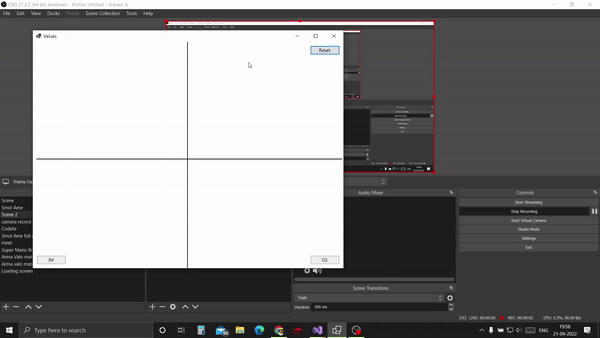

# ConvexHullAlgorithms
Visual Jarvis March and Graham's Scan algorithms on UI

# About
A small project made using C# and winforms which shows the final convex hulls made after using the Jarvis March and Graham Scale Algorithms

- To use just select the points on the app by clicking with your mouse and when finished press JM to run the Jarvis March algorithm and GS to run the Graham Scan algorithm
- Press Reset to reset everything and select new points

